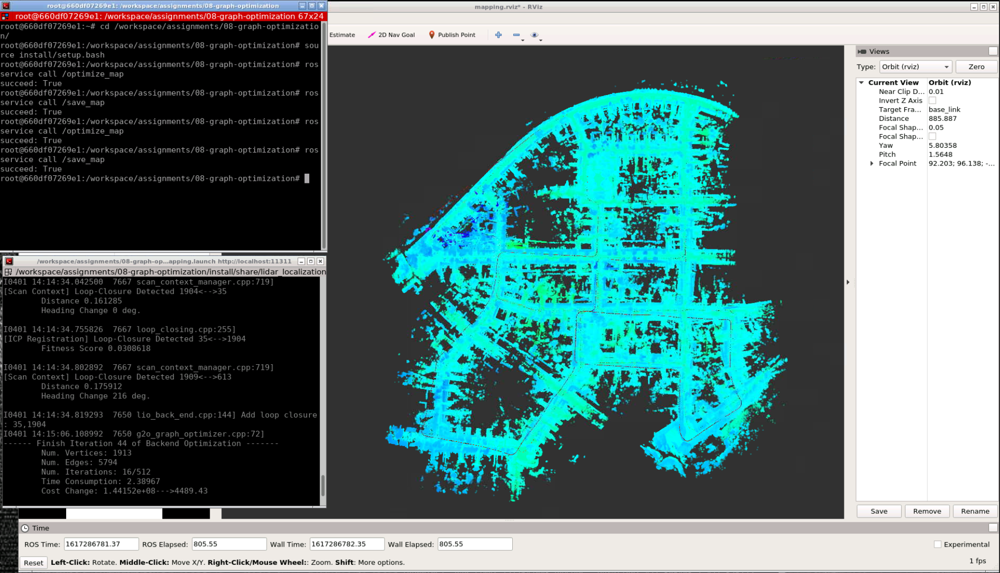
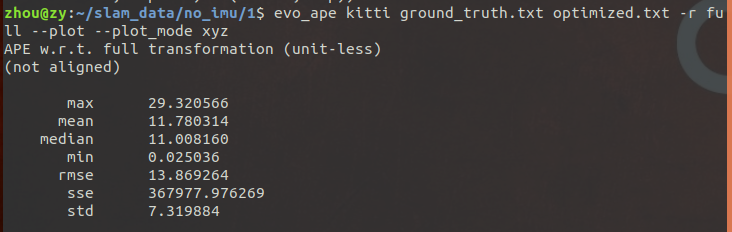
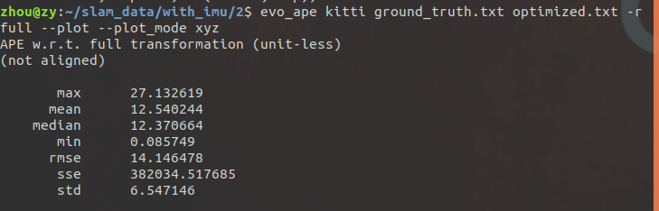
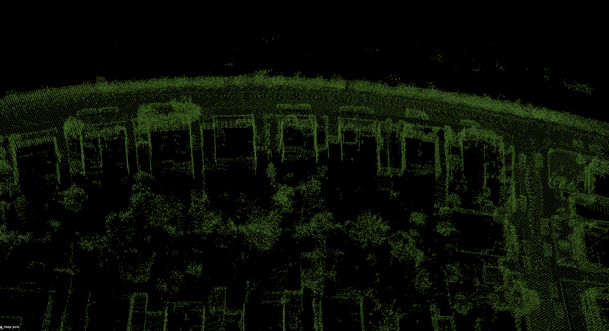
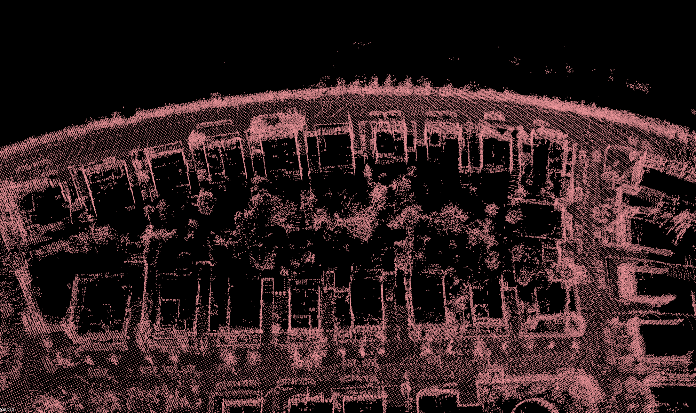
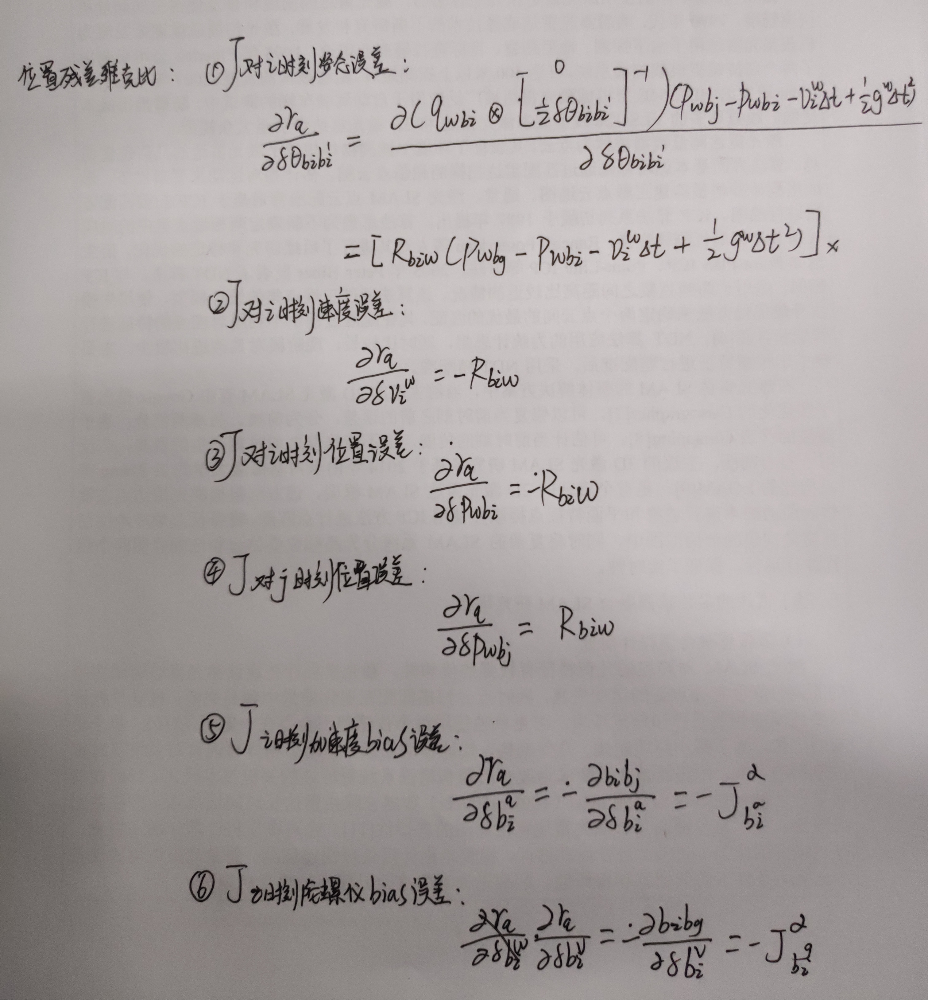

## 推导残差对其它变量的雅可比, 并在建图流程的代码中补全基于IMU预积分的融合方法中的待填内容，随后与不加IMU融合时的效果进行对比.

[TODO 1](https://github.com/bulinx/bulinx-09-graph/blob/57e008922990382b49c97170dd8655d1bceb510f/src/lidar_localization/src/models/pre_integrator/imu_pre_integrator.cpp#L232)

[TODO 2](https://github.com/bulinx/bulinx-09-graph/blob/57e008922990382b49c97170dd8655d1bceb510f/src/lidar_localization/src/models/pre_integrator/imu_pre_integrator.cpp#L250)

[TODO 3](https://github.com/bulinx/bulinx-09-graph/blob/57e008922990382b49c97170dd8655d1bceb510f/src/lidar_localization/include/lidar_localization/models/graph_optimizer/g2o/edge/edge_prvag_imu_pre_integration.hpp#L60)

[TODO 4](https://github.com/bulinx/bulinx-09-graph/blob/57e008922990382b49c97170dd8655d1bceb510f/src/lidar_localization/include/lidar_localization/models/graph_optimizer/g2o/edge/edge_prvag_imu_pre_integration.hpp#L70)

[TODO 5](https://github.com/bulinx/bulinx-09-graph/blob/57e008922990382b49c97170dd8655d1bceb510f/src/lidar_localization/include/lidar_localization/models/graph_optimizer/g2o/vertex/vertex_prvag.hpp#L73)

效果：

## 实现和不加IMU时的效果对比和分析

## 完成融合编码器时预积分公式的推导(方差递推、残差对状态量雅可比、bias更新等)

